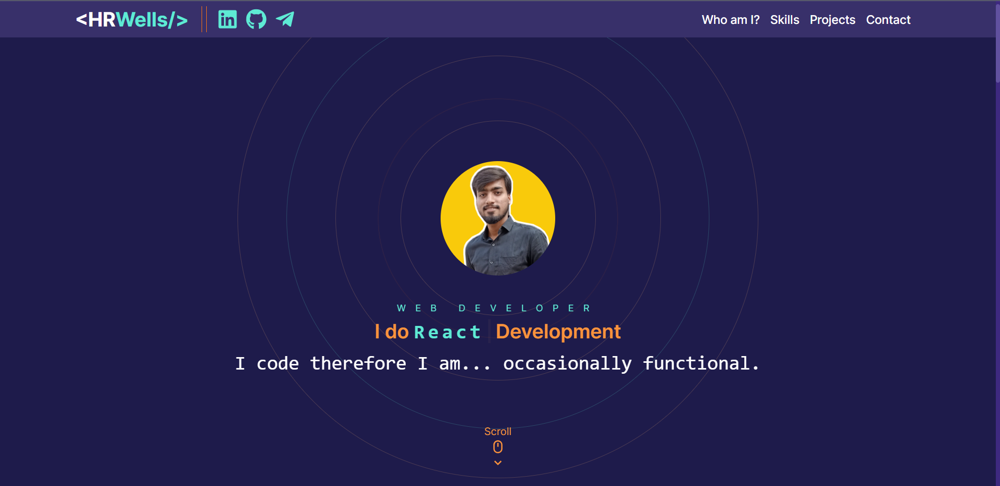
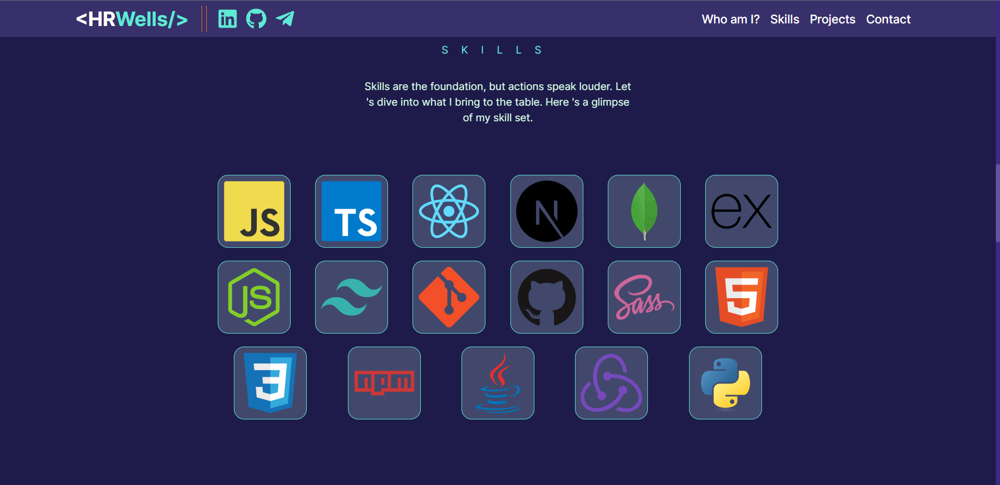
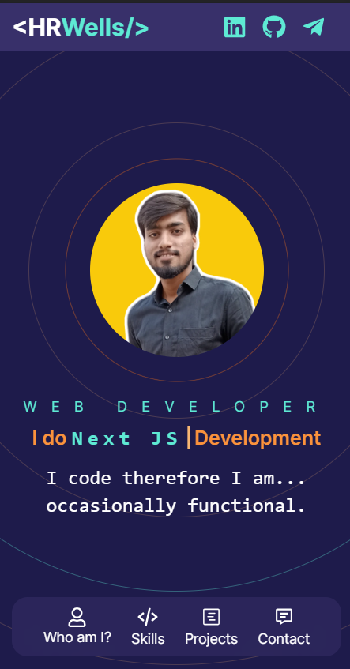

# Portfolio

## Description

Welcome to my portfolio! This project showcases my journey as a web developer and the diverse range of skills I've cultivated. It's built using Next.js, Sanity, TypeScript, and Tailwind CSS.

## Features

- Interactive and user-friendly design.
- Sections highlighting my skills, projects, and contact information.
- Smooth navigation and seamless user experience.

## Technologies Used

- [Next.js](https://nextjs.org/)
- [Sanity](https://www.sanity.io/) (not implemented yet)
- [TypeScript](https://www.typescriptlang.org/)
- [Tailwind CSS](https://tailwindcss.com/)

## Screenshots

  
   
  
   
  

## Live

Check out my live portfolio: [Shubham Kadam Portfolio](https://your-portfolio-demo-url.com)

## Accounts

- LinkedIn: [Shubham Kadam](https://www.linkedin.com/in/shubham-kadam-0620b722a/)
- Telegram: [HRWells](https://t.me/h_r_wells)
- Github: [H-R-Wells2](https://github.com/h-r-wells2)
- Email: [Shubham Kadam](mailto:kadamshubham10246@gmail.com)

